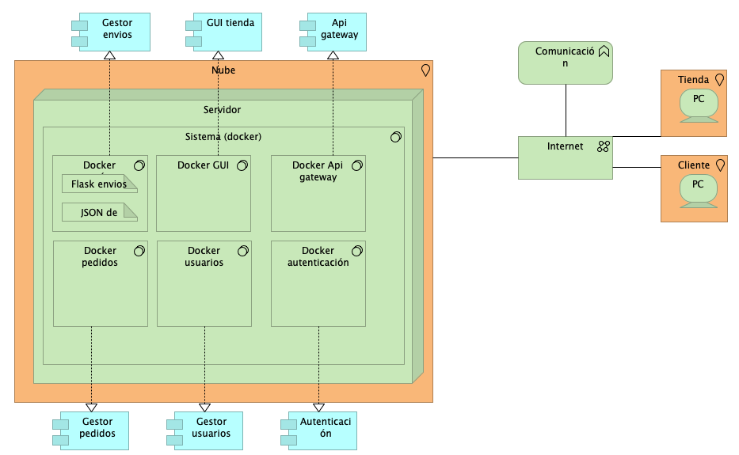
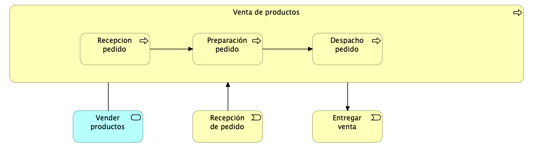

### Arquitectura y microservicos

## Arquitectura:

 

## Coperación de aplicaciones:

 

## Cooperación de procesos de negocios:

 

## Location:

 

 ## Estrcutura de aplicaciones:

 

  ## Funciones del negocio:

 

  ## Infraestructura:

 

 ## Organización e Implementación:

 

  ## Proceso de Negocio:

 

  ## Productos:

 

  ## Uso de aplicación:

 

  ## Uso de infraestructura:

 